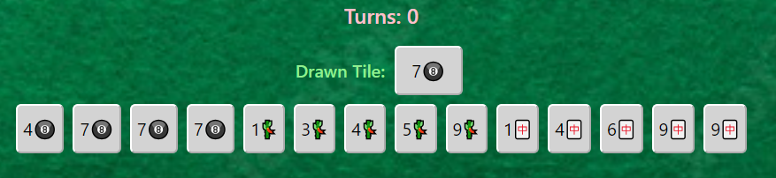

# **Mahjong Minigame**

### This is my [CS50’s Introduction to Computer Science](https://cs50.harvard.edu/x/2023/) final project submission. I Was inspired by the original game (which is much more complicated) which my friends and I would play over the Lunar New Year.

#
### A responsive simplified webgame of mahjong using HTML, CSS and Javascript.
### [Video Demo](https://youtu.be/Qs8BhSim7yY)

 

## Home Page
Home page consist of 2 button - 'Start Game' and 'How To Play'.

---

## How to Play Page
Once player clicks on the 'How To Play' button, it leads them to this page. This displays the goal and instruction on how to play the game.

### Goal
The objective of the game is achieve 1 pair and 4 sets. A pair is two identical tiles.
A set can either three identical tiles or three consecutive numbers in the same suit.
A single tile cannot be used in two sets at once.

---

# The game
Once player has clicked on the 'Start Game' button, it leads them to this page. The page has a restart game button on the top right to allow players to exit.

## Flow of the Game
<ul>
    <li>When the game starts, players are given 14 random tiles.
    <li>Each turn a random tile would be drawn.
    <li>Players would need to decide if they want to keep the newly drawn tile or discard the drawn tile.
        <ul>
            <li>If they decide to keep the newly drawn tile, the tile would replace the discarded tile chosen by the player.
            <li>While if they decide to discard the drawn tile, there would be no changes to the hand and the next turn begins.
        </ul>
    <li>At the end, the player's score would be the number of turns they took to win the game.
</ul>

A set of random **14 Tiles** are generated. This is your starting hand.
Tiles contain both a **number** - from 1 to 9, and a **suit** - 🎱🎋🀄. A randomly generated tile would also be displayed at the begining.

---

Afterwards users need to decided on which tile they would like to discard. A discard button will show up whenever the user clicks on the tile and by clicking on it, the tile will be discarded.
Before:

After:

If a user decideds to discard a Tile in the current Hand, the drawn Tile above would replaces the Tile in discarded by the user.

Meanwhile, if the user discards the drawn Tile, no changes would be made to the hand and a new turn begins.
Before:

After:

---

**Win condition**: Gather **4** Sets of Triplets **and/or** Consecutives along with **1** ending Pair.

